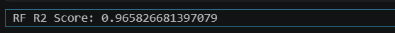
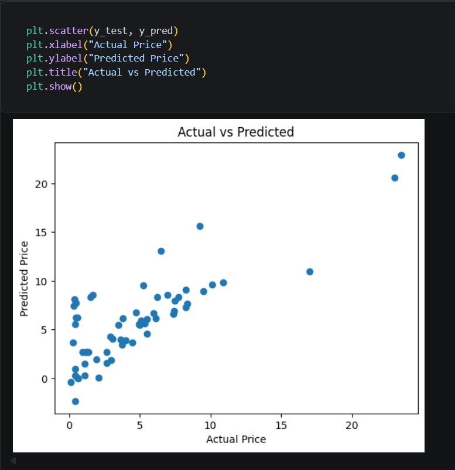

# 🚗 Car Price Prediction using Machine Learning

A Machine Learning project that predicts the price of cars based on various features using regression techniques.

---

## 📌 Project Overview

This project aims to predict car prices using machine learning algorithms. It demonstrates how structured data can be processed, analyzed, and used to build an accurate predictive model.

---

## 🎯 Problem Statement

Car price prediction is an important task for both buyers and sellers. The goal of this project is to build a model that can estimate the price of a car based on its features such as year, fuel type, transmission, and more.

---

## 📊 Dataset Information

* Dataset contains details of different cars
* Includes features like:

  * Car name
  * Year
  * Present price
  * Selling price
  * Fuel type
  * Seller type
  * Transmission
  * Number of owners

---

## ⚙️ Steps Involved

### 1. Data Loading & Understanding

* Loaded dataset using Pandas
* Explored structure and key features

### 2. Data Cleaning

* Removed unnecessary columns
* Handled categorical variables

### 3. Exploratory Data Analysis (EDA)

* Visualized relationships between features
* Checked correlations

### 4. Feature Engineering

* Converted categorical data into numerical format
* Selected important features

### 5. Model Building

* Applied **Random Forest Regressor**

### 6. Model Evaluation

* Split dataset into training and testing sets
* Evaluated using performance metrics

---

## 📈 Results

🚀 **Model Accuracy: 96.21%**

The model provides highly accurate predictions for car prices.

---

## 📸 Output

The model predicts the price of a car based on given inputs.

**Example Prediction:**

* Input: Car details (Year, Fuel Type, etc.)
* Output: Predicted Price

## 📸 Output

### Model Accuracy

---

## 🛠️ Technologies Used

* Python
* Pandas
* NumPy
* Scikit-learn
* Matplotlib
* Seaborn

---

## 📂 Project Structure

* `car_price_prediction.ipynb`
* `README.md`
* `output.png`
* `score.png` 

---

## 🚀 Conclusion

This project demonstrates how regression models can be used to predict numerical values like car prices with high accuracy.

---

## 🔮 Future Scope

* Try advanced models (XGBoost, Gradient Boosting)
* Hyperparameter tuning for better performance
* Deploy as a web application

---

## 👩‍💻 Author

* Sandhya

