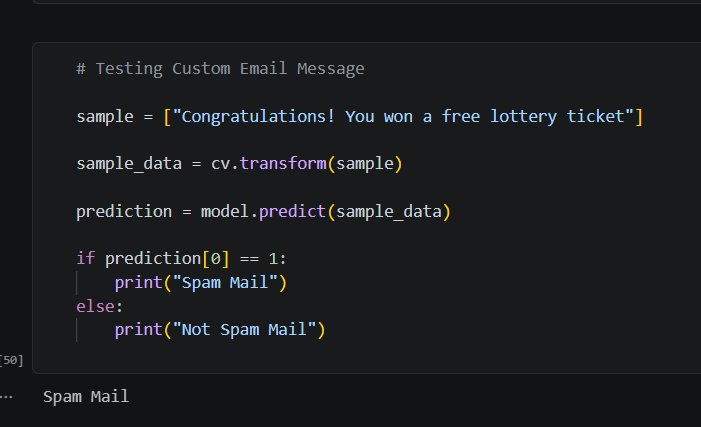

# 📧 Email Spam Detection using Machine Learning

A Machine Learning project that classifies emails as **Spam** or **Not Spam (Ham)** using Natural Language Processing (NLP) techniques.

---

## 📌 Project Overview

This project focuses on building a classification model to detect spam emails. It demonstrates how text data can be preprocessed, analyzed, and used to train a machine learning model for accurate predictions.

---

## 🎯 Problem Statement

Spam emails are a major problem in digital communication. The objective of this project is to develop a model that can automatically classify emails as spam or not spam.

---

## 📊 Dataset Information

* The dataset contains labeled email messages
* Two categories:

  * **Spam (1)**
  * **Not Spam (0)**
* Text content is used as the primary feature

---

## ⚙️ Steps Involved

### 1. Data Loading & Understanding

* Imported dataset using Pandas
* Explored structure and basic information

### 2. Data Cleaning

* Removed unnecessary columns
* Converted labels into numerical format

### 3. Exploratory Data Analysis (EDA)

* Visualized spam vs non-spam distribution using countplot

### 4. Text Processing

* Converted text data into numerical vectors using **CountVectorizer**

### 5. Model Building

* Implemented **Multinomial Naive Bayes** for classification

### 6. Model Evaluation

* Split data into training and testing sets
* Evaluated performance using accuracy score

---

## 📈 Results

🚀 **Model Accuracy: 97.48%**

The model performs very well in distinguishing spam and non-spam emails.

---

## 📸 Output

The model successfully predicts whether a message is spam or not.

**Example Prediction:**

* Input: "Congratulations! You won a free lottery ticket"
* Output: Spam

### Output Screenshot

---

## 🛠️ Technologies Used

* Python
* Pandas
* NumPy
* Scikit-learn
* Matplotlib
* Seaborn

---

## 📂 Project Structure

* `spam_detection.ipynb`
* `README.md`
* `output.png`

---

## 🚀 Conclusion

This project shows how machine learning can be effectively applied to text classification problems like spam detection with high accuracy.

---

## 🔮 Future Scope

* Improve text preprocessing techniques
* Experiment with advanced models (Logistic Regression, Deep Learning)
* Deploy as a web application using Streamlit or Flask

---

## 👩‍💻 Author

* Sandhya

