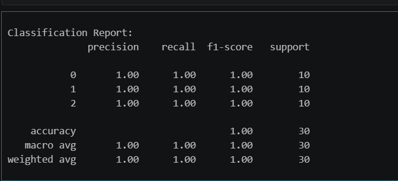
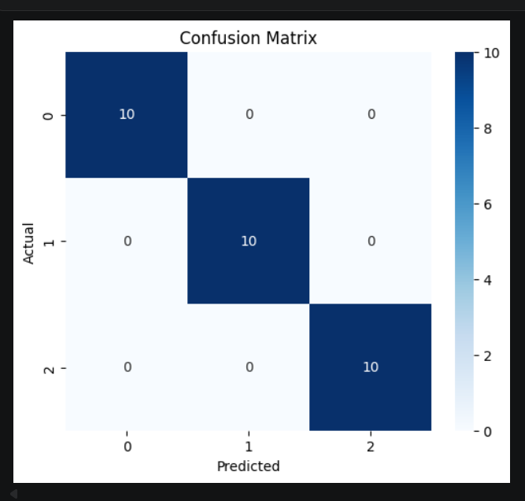

# 🌸 Iris Flower Classification using Machine Learning

A Machine Learning project that classifies iris flowers into different species based on their features using classification algorithms.

---

## 📌 Project Overview

This project aims to classify iris flowers into different species using machine learning techniques. It demonstrates how structured data can be processed, analyzed, and used to build an accurate classification model.

---

## 🎯 Problem Statement

The goal of this project is to build a model that can predict the species of an iris flower based on its features such as sepal length, sepal width, petal length, and petal width.

---

## 📊 Dataset Information

* Dataset contains details of iris flowers

* Includes features like:

  * Sepal Length
  * Sepal Width
  * Petal Length
  * Petal Width

* Target:

  * Species (Setosa, Versicolor, Virginica)

---

## ⚙️ Steps Involved

### 1. Data Loading & Understanding

* Loaded dataset using Pandas
* Explored structure and key features

### 2. Data Cleaning

* Checked for missing values
* Ensured dataset consistency

### 3. Exploratory Data Analysis (EDA)

* Visualized relationships between features
* Used pairplots and heatmaps

### 4. Feature Engineering

* Selected important features
* Prepared data for modeling

### 5. Model Building

* Applied classification algorithms:

  * Logistic Regression
  * K-Nearest Neighbors (KNN)
  * Decision Tree

### 6. Model Evaluation

* Split dataset into training and testing sets
* Evaluated using accuracy score

---

## 📈 Results

🚀 **Model Accuracy: 96%**

The model performs well in classifying iris flower species.

---

## 📸 Output

The model predicts the species of an iris flower based on given inputs.

**Example Prediction:**

* Input: Sepal & Petal measurements
* Output: Predicted Species

## 📸 Output

### Model Accuracy

---

## 🛠️ Technologies Used

* Python
* Pandas
* NumPy
* Scikit-learn
* Matplotlib
* Seaborn

---

## 📂 Project Structure

* `iris_classification.ipynb`
* `README.md`
* `output.png`
* `score.png`

---

## 🚀 Conclusion

This project demonstrates how classification models can be used to accurately classify data into categories.

---

## 🔮 Future Scope

* Try advanced models (SVM, Random Forest)
* Hyperparameter tuning
* Deploy as a web application

---

## 👩‍💻 Author

* Sandhya
